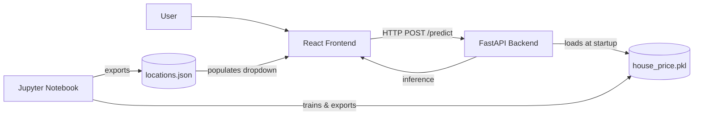

# iti-final-project

House Price Prediction — an end-to-end machine learning web application that estimates property prices for real estate listings in India. The system covers the full pipeline from raw data to a deployed web interface: data cleaning and feature engineering, model training and evaluation, a REST API serving the trained model, and a web client for end users.

## Table of Contents

- [Overview](#overview)
- [Team](#team)
- [Architecture](#architecture)
- [Tech Stack](#tech-stack)
- [Project Structure](#project-structure)
- [Dataset](#dataset)
- [Getting Started](#getting-started)
  - [Prerequisites](#prerequisites)
  - [Clone the Repository](#clone-the-repository)
  - [Backend Setup](#backend-setup)
  - [Frontend Setup](#frontend-setup)
  - [Model Training](#model-training)
- [Environment Variables](#environment-variables)
- [API Reference](#api-reference)
- [Model](#model)
- [Testing](#testing)
- [Development Workflow](#development-workflow)
- [Roadmap](#roadmap)
- [Acknowledgments](#acknowledgments)
- [License](#license)

## Overview

Real estate pricing in India varies significantly across regions, property types, and listing conditions, and raw listing data is often inconsistent and difficult to work with directly. This project builds a complete, reproducible pipeline that:

1. Cleans and transforms a large, real-world property listings dataset.
2. Trains and evaluates multiple regression models to estimate property price.
3. Exposes the trained model through a REST API.
4. Provides a web interface where a user can enter property details and receive a price estimate in real time.

The project was developed as a final submission for the Information Technology Institute (ITI) machine learning track.

## Team

| Name | Email |
|---|---|
| Mohamed Kassem | Kasem.altaher009@gmail.com |
| Rahma Ayman | rahmaayman2268@gmail.com |
| Mohamed Bashar | mohamednbashar@gmail.com |

## Architecture



The frontend collects property details from the user and sends them to the backend API. The backend loads a trained scikit-learn pipeline once at startup, applies preprocessing and inference on incoming requests, and returns a predicted price. The model itself is trained separately in a Jupyter notebook and exported as a serialized pipeline, so no manual encoding logic is duplicated in the backend.

## Tech Stack

**Data & Modeling**
- Python 3.11
- pandas, numpy
- scikit-learn
- Jupyter Notebook
- matplotlib, seaborn
- joblib

**Backend**
- FastAPI
- Pydantic / pydantic-settings
- Uvicorn
- pytest, httpx

**Frontend**
- React
- TypeScript
- Vite
- React Router

**Tooling**
- Git and GitHub
- Docker & Docker Compose (backend and frontend containerization)

## Project Structure

```
iti-final-project/
├── notebooks/
│   ├── data/
│   │   └── house_prices.csv
│   └── ITI_Project.ipynb
├── backend/
│   ├── app/
│   │   ├── main.py
│   │   ├── api/
│   │   │   └── routes/
│   │   │       └── prediction.py
│   │   ├── core/
│   │   │   └── config.py
│   │   ├── schemas/
│   │   │   └── prediction.py
│   │   └── services/
│   │       ├── preprocessing.py
│   │       └── inference.py
│   ├── models/
│   │   └── Gradient_Boosting_Model.pkl
│   ├── tests/
│   │   └── test_prediction.py
│   ├── requirements.txt
│   ├── .env.example
|   ├── .dockerignore
│   └── Dockerfile
├── frontend/
│   ├── src/
│   │   ├── api/
│   │   │   └── predictionClient.ts
│   │   ├── components/
│   │   │   └── PredictionForm.tsx
│   │   ├── pages/
│   │   │   ├── HomePage.tsx
│   │   │   ├── ResultPage.tsx
│   │   │   └── NotFoundPage.tsx
│   │   ├── types/
│   │   │   └── prediction.ts
│   │   ├── data/
│   │   │   └── locations.json
│   │   ├── App.tsx
│   │   └── main.tsx
│   ├── .env.example
│   ├── .dockerignore
│   ├── Dockerfile
│   └── package.json
├── .gitignore
└── README.md
```

## Dataset

**Source:** [House Price dataset by Juhi Bhojani](https://www.kaggle.com/datasets/juhibhojani/house-price) (Kaggle)

The dataset contains approximately 187,000 real property listings from India, with fields including title, description, price, location, carpet area, floor, transaction type, furnishing status, facing direction, ownership type, bathroom and balcony counts, and more. The raw price and area fields are stored as free-text (for example, `"42 Lac"` or `"1200 sqft"`) and require parsing before use, and several categorical fields contain a large number of distinct values that require grouping. Data cleaning and feature engineering steps are documented in `notebooks/house_price_model.ipynb`.

The raw dataset CSV is not committed to this repository due to its size. Download it before running the notebook:

**Option A — Manual download**

Download the dataset from the Kaggle page above, unzip it, and place `house_prices.csv` inside `notebooks/data/`.

**Option B — Kaggle CLI**

```bash
pip install kaggle
# Generate an API token from Kaggle: Settings -> API -> Create New Token
# Place kaggle.json in %USERPROFILE%\.kaggle\ (Windows) or ~/.kaggle/ (macOS/Linux)
kaggle datasets download -d juhibhojani/house-price -p notebooks/data --unzip
```

## Getting Started

### Prerequisites

| Tool | Minimum Version |
|---|---|
| Python | 3.11 |
| Node.js and npm | 18 |
| Git | Any recent version |
| Kaggle account | — |

### Clone the Repository

```bash
git clone https://github.com/<organization-or-username>/iti-final-project.git
cd iti-final-project
```

### Backend Setup

```bash
cd backend
python -m venv .venv
.venv\Scripts\activate      # Windows
# source .venv/bin/activate # macOS / Linux

pip install -r requirements.txt
cp .env.example .env

uvicorn app.main:app --reload
```

The API will be available at `http://localhost:8000`. Interactive documentation is available at `http://localhost:8000/docs`.

### Frontend Setup

```bash
cd frontend
npm install
cp .env.example .env

npm run dev
```

The application will be available at `http://localhost:5173`.

### Running with Docker

The backend and frontend can be run together using Docker Compose:

​```bash
docker compose up --build
​```

This builds and starts both containers. The backend is available at `http://localhost:8000` and the frontend at `http://localhost:5173`. The backend container mounts `backend/models/` as a volume, so the trained model file must be present there before starting. The frontend image receives the backend URL at build time via the `VITE_API_BASE_URL` build argument (configured in `docker-compose.yml`).


### Model Training

```bash
cd notebooks
jupyter notebook house_price_model.ipynb
```

Run all cells to reproduce data cleaning, exploratory analysis, model training and evaluation. Running the final cells exports `house_price.pkl` and `locations.json`, which should be copied into `backend/models/` and `frontend/src/data/` respectively.

## Environment Variables

***Backend (`backend/.env`)**

| Variable | Description | Example |
|---|---|---|
| `MODEL_PATH` | Path to the serialized model file | `models/house_price.pkl` |
| `LOCATIONS_PATH` | Path to the exported list of top locations | `models/locations.json` |
| `ALLOWED_ORIGINS` | CORS-allowed origins for the frontend | `http://localhost:5173` |


**Frontend (`frontend/.env`)**

| Variable | Description | Example |
|---|---|---|
| `VITE_API_BASE_URL` | Base URL of the backend API | `http://localhost:8000` |

## API Reference

### Health Check

```
GET /health
```

**Response**

```json
{
  "status": "ok"
}
```

### Predict Price

```
POST /predict
```

**Request Body**

​```json
{
  "bhk": 2,
  "bathroom": 2,
  "balcony": 1,
  "area_sqft": 850,
  "current_floor": 3,
  "total_floors": 10,
  "furnishing": "Semi-Furnished",
  "transaction": "Resale",
  "ownership": "Freehold",
  "facing": "East",
  "location": "thane",
  "area_source": "carpet"
}
​```

**Response**

​```json
{
  "predicted_price": 7306032.21
}
​```

**Example Request**

​```bash
curl -X POST http://localhost:8000/predict \
  -H "Content-Type: application/json" \
  -d '{
    "bhk": 2,
    "bathroom": 2,
    "balcony": 1,
    "area_sqft": 850,
    "current_floor": 3,
    "total_floors": 10,
    "furnishing": "Semi-Furnished",
    "transaction": "Resale",
    "ownership": "Freehold",
    "facing": "East",
    "location": "thane",
    "area_source": "carpet"
  }'
​```

## Model

Preprocessing and inference are bundled into a single scikit-learn pipeline wrapped in a `TransformedTargetRegressor`. The `ColumnTransformer` applies standard scaling to numeric features (`bhk`, `bathroom`, `balcony`), a log transform plus scaling to skewed numeric features (`area_sqft`, `current_floor`, `total_floors`), and one-hot encoding to categorical features (`Furnishing`, `Transaction`, `Ownership`, `facing`, `location`, `area_source`). The target price is log-transformed during training (`np.log1p`) and automatically inverse-transformed on prediction (`np.expm1`) by the `TransformedTargetRegressor`, so the backend receives ready-to-use price predictions with no manual inverse transform required.

At least two models were trained and compared on a held-out test set: a linear regression baseline and ensemble models (Random Forest and Gradient Boosting regressors). The Gradient Boosting model was selected for serving due to a significantly smaller serialized file size, making it practical to commit and containerize.

**Evaluation metrics (test set)**

| Model | R² | MAE (rupees) | RMSE (rupees) | MAPE |
|---|---|---|---|---|
| Random Forest | 0.892 | 941,532 | 4,582,794 | 8.6% |
| Gradient Boosting | TBD | TBD | TBD | TBD |


## Testing

Backend tests use `pytest` and FastAPI's `TestClient`, covering both valid and invalid request scenarios.

```bash
cd backend
pytest
```

## Development Workflow

- `main` is the stable branch. Direct commits to `main` are avoided once active development begins.
- Feature work is done on dedicated branches (for example, `feature/backend-api`, `feature/frontend-form`, `feature/ml-model`).
- Changes are merged into `main` through pull requests, reviewed by at least one other team member where possible.
- Environment files (`.env`), dependency directories (`node_modules/`, `.venv/`), and the raw dataset CSV are excluded from version control via `.gitignore`.

## Roadmap

- [ ] Complete data cleaning and feature engineering notebook
- [ ] Train and evaluate baseline and ensemble models
- [ ] Export trained pipeline and location list
- [ ] Implement FastAPI backend endpoints
- [ ] Implement React frontend form and result page
- [ ] Integrate frontend with live backend
- [ ] Add application screenshots to this document
- [ ] Deploy backend and frontend

## Acknowledgments

Dataset provided by Juhi Bhojani on Kaggle: [House Price dataset](https://www.kaggle.com/datasets/juhibhojani/house-price).

## License

This project was developed for academic purposes as part of the Information Technology Institute (ITI) training program.